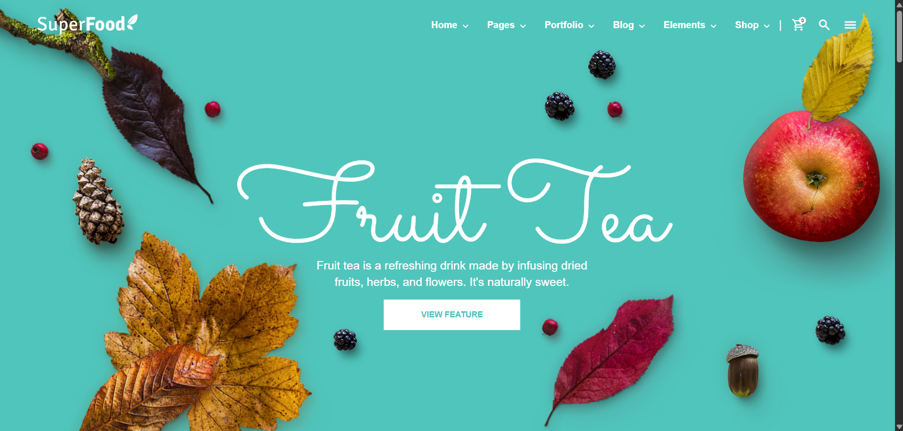

# 🥗 Super Food Template 🍎🍊

A fully responsive and animated **static food website template** built using **HTML**, **Tailwind CSS**, and **JavaScript**.  
This project features floating fruit animations like apples and oranges to give a fun, healthy-food-themed vibe. Ideal for practice, learning, or food-related portfolios.

---

## 🌟 Features

- Animated fruits using CSS `transform` and `transition`
- Responsive layout built with Tailwind CSS
- Mobile-friendly hamburger menu
- Clean, semantic HTML structure
- Custom fonts from Google (Sacramento, Open Sans, Signika)
- Easy to customize and extend

---

## ⚙️ Technologies Used

- HTML  
- Tailwind CSS  
- JavaScript  
- Google Fonts

---

## 📸 Screenshots

Here is a preview of the Super Food Template:



---

## 🚀 How to Run the Project

1. Clone the repository:
   ```bash
   git clone https://github.com/Ansari-Soman/super-food-template.git

2. Navigate into the project folder:
   ```bash
   cd super-food-template

3. Run the project:
   - Open the `index.html` file directly in your browser  
   - **Or** use the **Live Server** extension in VS Code for automatic reloading


## 📁 Folder Structure
super-food-template/
├── .vscode/              # VSCode settings (optional)
├── css/                  # Tailwind or compiled CSS
├── images/               # Assets like fruit images and screenshots
├── node_modules/         # Installed dependencies
├── scripts/              # JavaScript files
├── index.html            # Main HTML file
├── package.json          # NPM configuration
├── package-lock.json     # NPM lock file
└── README.md             # Project documentation

## 🙌 Author

- [Ansari Soman](https://github.com/Ansari-Soman)

---

Feel free to use this project for learning or personal use!


